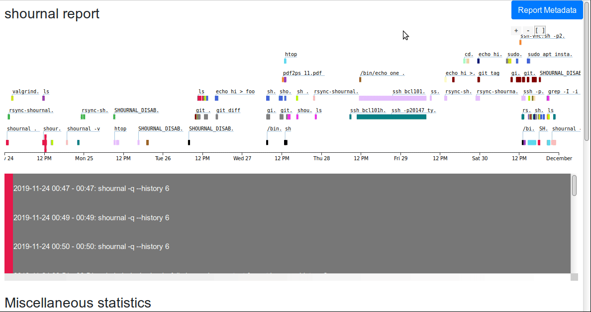

## A (file-) journal for your shell

**Log shell-commands and used files. Snapshot executed scripts. Fully automatic.** <br>
*There are two kinds of people: those who backup, and those who have never
 lost their data.* <br>


~~~
$ SHOURNAL_ENABLE
$ cat demo.sh
#!/usr/bin/env bash
echo hi | tee out.log
$ ./demo.sh
hi
$ shournal -q --wfile out.log
cmd-id 2 $?=0 2022-11-08 08:46 $ ./demo.sh
Working directory: /home/user
  1 written file:
     /home/user/out.log (3 bytes) Hash: 15349503233279147316
  1 read file:
     /home/user/demo.sh (42 bytes) Hash: 13559791986335963073 id 1
          #!/usr/bin/env bash
          echo hi | tee out.log
~~~

***shournal* records that `out.log` was written by the command `./demo.sh` and
created a backup of the script `demo.sh` because it was read by
the bash interpreter.**

*shournal* does not guess the files - it asks the Linux kernel. It's fast enough,
see [Overhead](#overhead).


After installation and easy setup of the
[shell-integration](./README-shell-integration.md) the following questions
may be answered within seconds:
* What files were modified or read by a command? Or reverse: What shell-commands
  were used to create/modify or read from a certain file?
* You executed a script. What was the script-content by the time it was called?
* The command read a config-file - which one, and what was in it?
* What other commands were executed during the same shell-session?
* What about working directory, command start- and end-time or the
  exit status ($?) ?


Besides output on the command-line in a human-readable format (or JSON)
you can export (parts of) your command-history into
a standalone html-file where it is displayed in an interactive
time-line-plot. Further miscellaneous statistics are displayed in
bar-plots, e.g. the commands with most file-modifications.

Using the external software
[shournal-to-snakemake]( https://github.com/snakemake/shournal-to-snakemake)
an observed shell-command-series can be directly transformed into rules for
the [*Snakemake workflow engine*](https://github.com/snakemake/snakemake),
a tool to *create reproducible and scalable data analyses*.

*shournal* runs only on GNU/Linux.

 *For a more formal introduction please also check out our preprint
[Bashing irreproducibility with
shournal](https://doi.org/10.1101/2020.08.03.232843)
on bioRxiv.*



## Examples
Please note: below examples make use of the
[shell-integration](./README-shell-integration.md). <br>

* Create a file and ask shournal, how it came to be:
  ~~~
  $ SHOURNAL_ENABLE # monitor all commands using the shell-integration
  $ echo hi > foo
  $ shournal --query --wfile foo
  cmd-id 1 $?=0 2019-05-14 10:19 $ echo hi > foo
    1 written file:
       /home/user/foo (3 bytes) Hash: 15349503233279147316

  ~~~
* shournal can be configured, to store *specific* read files, like shell-scripts,
  within it's database. Sometimes old script versions are of interest. Query
  by **read filename** and optionally restore the files with `--restore-rfiles`:
  ~~~
  $ shournal -q --rname demo.sh
  cmd-id 34 $?=0 2022-04-21 15:15 $ ./demo.sh
    1 read file:
       /home/user/demo.sh (34 bytes) Hash: 16696055267278105544 id 3
            #!/usr/bin/env bash
            echo version1
  cmd-id 35 $?=0 2022-04-21 15:15 $ ./demo.sh
    1 read file:
       /home/user/demo.sh (34 bytes) Hash: 17683376525180966954 id 4
            #!/usr/bin/env bash
            echo version2
  $ shournal -q --rname demo.sh --restore-rfiles # restore read files
  ...
  2 file(s) restored at /tmp/shournal-restore-user
  ~~~
* List all commands which contained the string `demo` (<kbd>%</kbd> is wildcard):
  ~~~
  $ shournal -q -cmdtxt %demo%
  cmd-id 1 $?=0 2022-04-20 15:46 $ cat demo.sh
  ...
  cmd-id 2 $?=0 2022-04-20 15:46 $ ./demo.sh
  ...
  ~~~
* What commands were executed at the current working directory?
  ~~~
  shournal --query -cwd "$PWD"
  ~~~
* What commands were executed within a specific shell-session? The
  uuid can be taken from the command output of a previous query.
  ~~~
  shournal --query --shell-session-id $uuid
  ~~~
* Find out the value of a variable.
  For instance, the command `echo $foo > bar` was executed in the shell-session
  with id `puLvkEizEe6CgvXjQlmnIQ==`. If `foo` was set within that shell
  session, its value can often be retrieved by
  ~~~
  shournal -q -sid puLvkEizEe6CgvXjQlmnIQ==  | fgrep 'foo='
  ~~~
* For the full list of query-options, please enter
  ~~~
  shournal --query --help
  ~~~

Instead of printing the `--query`-results to terminal, you can also create
fancy html-plots, by appending `--output-format html -o out.html`.
Use an ordinary web-browser for display.


## Installation

### Binary releases
For **Debian/Ubuntu-based** distributions .deb-packages are available on the
[release-page](https://github.com/tycho-kirchner/shournal/releases/latest).
Three different editions are provided for different use-cases: most users will
want to install *shournal* on a real host (or virtual machine) and
*shournal-docker* [inside Docker](#running-inside-docker)
(or another container platform).
*shournal-fanotify* does not contain the kernel backend and
is targeted at institutions where the usage of *out-of-tree kernel-modules*
is discouraged. <br>
Only LTS-releases are officially supported, the packages are known to work on
Debian 10 (Buster), Debian 11 (Bullseye), Ubuntu 18.04 (Bionic), Ubuntu 20.04 (Focal)
and Ubuntu 22.04 (Jammy Jellyfish).
Install deb-packages as usual, e.g. <br>
`sudo apt install ./shournal_2.2_amd64.deb` <br>
To enable the shell-integration:
* for *bash*: put the following to the end of your ~/.bashrc <br>
`source /usr/share/shournal/SOURCE_ME.bash` <br>
* for *zsh*: put the following to the end of your ~/.zshrc <br>
`source /usr/share/shournal/SOURCE_ME.zsh` <br>
and run `SHOURNAL_ENABLE` afterwards.

For **any Linux**, a flat binary is available on the
[release-page](https://github.com/tycho-kirchner/shournal/releases/latest)
to be used without installation:

~~~
tar -xf shournal-fanotify*.tar.xz
cd shournal-fanotify/
sudo groupadd shournalmsenter
sudo chown root shournal-run-fanotify && sudo chmod u+s shournal-run-fanotify
./shournal-run-fanotify -e echo Hello World

# Source shournal's shell integration from bashrc/zshrc, e.g.
# echo "source '$PWD/SOURCE_ME.bash'" >> ~/.bashrc
# echo "source '$PWD/SOURCE_ME.zsh'" >> ~/.zshrc
# Enable with: SHOURNAL_ENABLE.
~~~

An **update** of *shournal* should be performed after all users have
logged out, because the shell integrations need to be resourced.
Further in case of the *kernel module* backend unloading the old
version stops all running observations.

**After installation**:
Depending on your distribution, additional steps might be necessary to
enable the (recommended) uuidd-daemon. If systemd is in use, one
may need to:

    systemctl enable uuidd
    systemctl start uuidd


Add yourself or other users to the group *shournalk*: <br>
`sudo adduser $USER shournalk` (relogin to take affect). <br>
You may override this group:
~~~
mkdir -p /etc/shournal.d/
echo GROUPNAME > /etc/shournal.d/kgroup
~~~
replacing GROUPNAME with the value of your choice. This rule takes
into effect the next time shournal's kernel module is loaded ( so
call e.g. `modprobe -r shournalk; modprobe shournalk` or reboot).

More details and advanced options (logging commands executed via ssh)
can be found [here](./README-shell-integration.md).


### Compile and install from source
Please refer to the instructions found within the
[compile-README](./README-compile.md).


## FAQ
* **Does shournal track file rename/move operations?** <br>
  No, but most often it should not be a problem. Using the
  `--wfile` commandline-query-option, shournal finds the stored command
  by content (size, hash) and mtime, not by its name.
  For the name, `--wname` can be used.
  More concrete:
  ~~~
  shournal --exec sh -c 'echo foo > bar; mv bar bar_old'
  ~~~
  Querying for bar_old by content (`--wfile`-option) yields exactly
  the given command, however, `--wname bar_old` does **not** work
  (`--wname bar` of course works). To use the bar_old *file name*
  (and not content) as basis for a successful query, in this case
  `--command-text -like '%bar_old%'` can be used.
* **What happens to an appended file?** <br>
  How to get a "modification history"?
  Please read above rename/move-text first.
  Appending to a file is currently handled as if a new one was created -
  only the last command, which modified a given file can be found with
  good certainty (by file **content**).
  However, querying by path/file**name** works.
  If the file was appended *and* renamed, things get more complicated.
* **To track files, they can be hashed. Is that slow for big files?** <br>
  No, because per default only certain small parts of the file are hashed.
* **What does the following message mean and how to get rid of it?**: <br>
  `fanotify_mark: failed to add path /foobar ... Permission denied`.
  This message might be printed on executing a command with shournal.
  Most probably the administrator mounted a filesystem object for which you don't have
  permissions, thus you cannot *monitor* file events.
  In this case you cannot perform file operations at this path
  anyway, so it should be safe to silence this warning by adding the
  path within the config-file in section `[mounts]`. If you want to ignore all
  fanotify_mark permission errors, you can set the flag in section
  `[mounts]`:
  ~~~
  [mounts]
  ignore_no_permission = true
  ~~~

## Configuration
shournal stores a self-documenting config-file typically at
~/.config/shournal
which is created on first run. It can be edited either directly with
a plain text editor or via `--edit-cfg`.
For completeness, the most important points are listed here as well.
* Write- and read events can be configured, so only events occurring at
  specific (include-)paths are stored. Put each path into a separate
  line, all paths being enclosed
  by triple quotes:
  ~~~
  include_paths = '''
    /home/me
    /media
  '''
  ~~~
  Each exclude_path should be a sub-path of an include path.
* Note that by default, there
  is a limit on the number of logged events per command (max_event_count).
  Read files (e.g. scripts) can **further** be configured
  to be stored within shournal's database.
  Files are only stored, if the configured max. file-size, file extension
  (e.g. sh) and mimetype (e.g. application/x-shellscript) matches.
  To find a mimetype for a given file you should use <br>
  `shournal --print-mime test.sh`.
  The correspondence of mimetype and file extension
  is explained in more detail within the config-file.
  Further, at your wish, read files are only stored if *you* have write permission for them
  (not only read) - often system-provided scripts (owned by root) are not of particular
  interest.

  shournal will not store more read files per command, than max_count_of_files.
  Matching files coming first have precedence.


## Running inside Docker
To use *shournal* within Docker (or another container platform),
depending on the backend the following steps are necessary: <br>
**kernel module backend** <br>
Install *shournal* on the host and *shournal-docker* inside the container.
For *unprivileged* containers *sysfs* is mounted readonly. In this case
create a bindmount from /sys/kernel/shournalk_root to
/tmp/shournalk-sysfs, e.g. <br>
`docker run ... -v /sys/kernel/shournalk_root:/tmp/shournalk-sysfs`.

**fanotify backend** <br>
Install *shournal-docker* (or *shournal-fanotify*) inside docker.
For *unprivileged* containers the capabilities SYS_ADMIN, SYS_PTRACE and
SYS_NICE are required, e.g. <br>
`docker run ... --cap-add SYS_ADMIN --cap-add SYS_PTRACE --cap-add SYS_NICE`. <br>
You may need to [configure the backend](#backend-configuration).


## Running on a Amazon AWS EC2 instance
In order to run *shournal* on a Amazon AWS EC2 instance it may be
necessary, to enable additional software package repositories. For
Ubuntu 22.04 on a t3.micro instance enter the following commands before
installing *shournal*
~~~
sudo add-apt-repository universe
sudo apt update
~~~


## Backend configuration
shournal provides two backends, a custom *kernel module* and *fanotify*.
The *kernel module* is used by default, except the *shournal-fanotify*
edition is installed, where only the *fanotify* backend is
available. In general it is recommended to stick with the *kernel module*
as it is faster and has less interference with the process environment -
for example no new mount namespaces have to be created and no file
descriptor inheritance is necessary to wait for the end of a process
tree. See also:
[shell-integration](./README-shell-integration.md#limitations). <br>
If both backends are installed you may configure the default one globally
by creating the file `/etc/shournal.d/backend` or for each user by creating
`~/.config/shournal/backend` with content `ko` or `fanotify`.


## Disk-space - get rid of obsolete file-events
Depending on the file-activity of the observed commands, shournal's
database will sooner or later grow. When you feel that enough time
has passed and want to get rid of old events, this can be done by e.g.
`shournal --delete --older-than 1y`
which deletes all commands (and file-events) older than one year.
More options are available, see also
`shournal --delete --help`


## Remote file-systems
* *shournal* is able to monitor file events of specific processes (PID's).
  Therefore, remote filesystems such as NFS or sshfs can be observed as
  long as *shournal* runs on the same (virtual) machine as the observed
  process. Consequently file events *another kernel* performs are lost.
* For sshfs in case of the *fanotify* backend it is necessary,
  to add ```-o allow_root``` to the sshfs-options,
  otherwise permission errors during ```fanotify_mark``` are raised.
  See also: https://serverfault.com/a/188896


## Security
### kernel-module backend
In the kernel module it is ensured that each user is only allowed to
monitor his/her own processes. Further, the kernel thread, which processes
file events, runs with effective caller credentials and checks
allowed accesses on a per-file basis. Memory allocations are cgroup-aware,
even for reading (in case of hashing) and writing (in case of logging)
files.

### fanotify backend
*shournal-run-fanotify* is a so called "setuid"-program: whenever a regular user calls it, it runs
with root-permissions in the first place. As soon as possible, it runs effectively with user
permissions though.
It must be setuid for two reaons:
* fanotify requires root for initializing, because it is in
  principle able, to **forbid** a process to access a file. shournal does not make use
  of this feature so this is not a real security concern.
* unsharing the *mount namespace* requires root, because setuid-programs *could* still refer
  to seemingly obsolete mounts. This means that under awkward circumstances an unmount-event,
  which has security-relevant consequences (e.g. mounting a new file to /etc/shadow) might not
  propagate to processes which run in other mount namespaces.
  To make sure mount-propagation applies, **all mounts, which carry setuid-binaries
  or files they refer to, should be mounted *shared***, or no (security-relevant)
  mount/unmount events should occur, after the first shournal-process started.
  Shared mounts are the default in all recent distributions I know of.
  See also
  man 7 mount_namespaces and
  [shared subtrees](https://www.kernel.org/doc/Documentation/filesystems/sharedsubtree.txt).


## Limitations
Processes can communicate via IPC (inter-process-communication).
If the observed process *A* instructs the **not** observed process *B*
via IPC to modify a file, the filesystem-event is not registered by
*shournal*.

For performance reasons, all files opened with write-permissions
are reported as *written* by shournal, irrespective of whether
the process actually wrote to it. By using file size and content (hash)
you should be able to cover those cases.

The provided timestamp is determined shortly after a file was
closed. Note that it is possible that some other process has
written to it in between. This however is only a
problem, if that other process was itself **not** observed.

Whether memory mapped (see mmap(2) ) file-events are reported correctly
depends on **when** the underlying file-descriptor is closed. It is thus
application dependent and does not work in general.

### Additional limitations of the fanotify backend
The file observation only works, if the process does not unshare the
mount-namespace itself, e.g. monitoring a program started
via *flatpak* fails.
For further limitations please visit the fanotify manpage.


## Known Issues
* on NFS-storages: file events are lost, if the user does not have
  read-permissions while a file is closed.
  Steps to reproduce:
  - open a file readable for you on a NFS storage
  - chmod it 000
  - close it --> the event is lost


## How does it work?
shournal attempts to deterministically associate files and shell-
commands without changing the users workflow. Under Linux file operations are
performed by the kernel, tracing these operations thus requires OS-level support.
During the execution of a shell-command, shournal instruments the kernel to
trace files used by the shell-process and any of it’s descendant processes. More
particular, to keep the tracing-overhead low, only the closing of files is traced
and (meta-)data collection starts afterwards in an asynchronous manner.

**shournalk** as a kernel module runs directly in *kernel space* and is based on
[tracepoints](https://www.kernel.org/doc/html/latest/trace/tracepoints.html)
and the
[ftrace-framework](https://www.kernel.org/doc/Documentation/trace/ftrace.txt)
which basically allow for custom code to be run at certain kernel
execution paths without recompilation of the kernel itself. Only three
events are traced: closing of files, fork and exit. (Meta-)data collection
also takes place entirely in kernel space.

The **fanotify backend** employs the kernel-native
[fanotify filesystem API]( https://man7.org/linux/man-pages/man7/fanotify.7.html)
to register for close-events of whole
mount-points which are isolated against unrelated
processes using unshared
[mount namespaces](https://man7.org/linux/man-pages/man7/mount_namespaces.7.html).
shournal thereby ensures that all file-operations during the execution of a shell-
command refer to the same, unique mount namespace. While the process-filtering
takes place in kernel space — so only file-events of observed processes
are copied to user-space — the (meta-)data collection happens in user
space.


## Overhead
File tracing imposes a **runtime overhead**.
A detailed performance evaluation may follow soon. For now:
We measured the following command executions with shournal v2.9:
* compile elfutils-0.176
* git checkout — checkout the Linux kernel’s source code from v4.19 to v3.10.
* kernel copy — cp of the 4.19 Linux source.

The relative runtime-overheads are shown in below table,
strace is listed for comparison with ptrace-based solutions:

|    Backend    | compile | checkout |  cp   |
| ------------- | ------- | -------- | ----- |
| kernel module |  0.05%  |   0.49%  | 0.29% |
| fanotify      |  1.2%   |   1.3%   | 6.2% |
| (strace)      |  140%   |   41%    | 100%  |

The benchmark involves tracing, (meta-)data collection and saving to
a binary temporary file. As this file can be kept indefinitely, the
final storing into the SQL-database is not part of the runtime-measurement.

For the `cp` benchmark, where ~120.000 file-events occurred
in ~4 seconds, the runtime overhead of the fanotify backend may become
noticeable. Note that many file-events in short time constitute a
worst-case. Where performance is critical, the kernel module backend
should be used.

The **storage overhead** largely depends on configuration, e.g. the number
of stored scripts and file-metadata is limited by default, to avoid e.g.
a backup-script from flooding the database. For the cp-test
the average disk-usage per file-event is approx. 174 bytes which already
includes indexes to speed up queries. So one GiB of disk-space is
sufficient for approx. 6 million events. Based on the experience of real-world
users the database is typically not larger than a few hundred megabytes
after months of usage.


## Credits
shournal makes use of great tools and libraries, most importantly the Qt-framework,
xxhash, tsl::ordered_map and cmake and also the Linux-Kernel's *fanotify*.
For the html-plot d3js, jquery, popper.js, bootstrap, webpack
and others are used.

Thanks to the developers!

The project arose in the Hoffmann Research
Group: Computational Biology of Aging
at the Fritz Lipmann Institute in Jena (Germany).
Special thanks to
Steve&nbsp;Hoffmann
and Konstantin&nbsp;Riege - without you this project
couldn't have been accomplished.


# License
The whole project is licensed under the GPL, v3 or later
(see LICENSE file for details) <br>
**except**
* The kernel module within `kernel/` which is licensed under
  the GNU General Public License version 2 only.
* The libraries within
  `extern/` → Please refer to the licenses within their
    respective directories.
* The javascript-libraries in the auto-generated
  `html-export/dist/main.js` → the licenses are
  stored in `html-export/dist/main.licenses.txt`.


Copyleft (C) 2021, Tycho Kirchner
